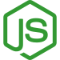

### Hi there, I'm Ivan Suprun 👋

- I'm Fullstack Frontend Developer, graduated GOIT School ⚡
- Currently learning TypeScript and brushing up my knowledge of React 🌱

How to reach me:

- 💬 LinkedIn: https://www.linkedin.com/in/vanya-suprun/
- 📫 Email: bender.slam@gmail.com

I working with stacks:

<!--
**Bender148/Bender148** is a ✨ _special_ ✨ repository because its `README.md` (this file) appears on your GitHub profile.

Here are some ideas to get you started:

- 🔭 I’m currently working on ...
- 🌱 I’m currently learning ...
- 👯 I’m looking to collaborate on ...
- 🤔 I’m looking for help with ...
- 💬 Ask me about ...
- 📫 How to reach me: ...
- 😄 Pronouns: ...
- ⚡ Fun fact: ...
-->
